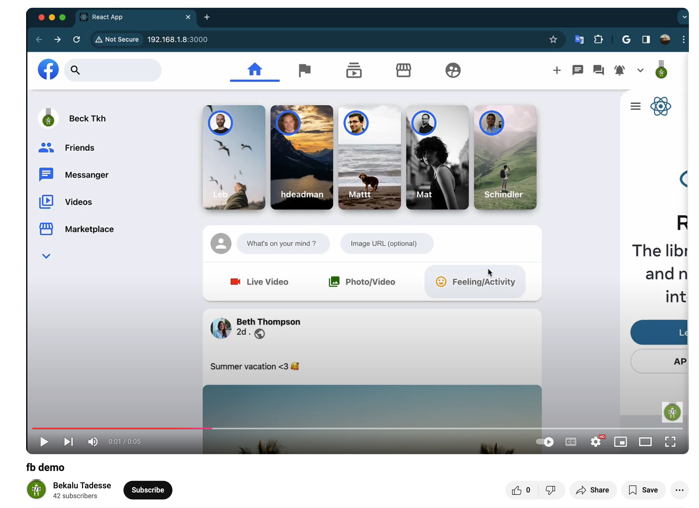

# React FACEBOOK Clone

## Overview

A modern, responsive web application replicating the core functionality and design of Facebook, built using React and Material UI.

---

## Key Features

- Developed using React for efficient and modular UI components.
- Leveraged Material UI for modern design elements and clean icons.
- Includes responsive design and a user-friendly interface.

---

### Demo

[](https://youtu.be/zVffu5_T7UE)

### Technologies Used

- `React:` For building the dynamic user interface.
- `Material UI:` For icons and UI consistency.

## Getting Started

To explore the project locally, follow these steps:

1. Clone the repository.
2. Install dependencies using `npm install`.
3. Run the application in development mode with the following command:

```bash
npm start
```

### icons

clean icons from Material UI [https://mui.com/material-ui/getting-started/installation/](https://mui.com/material-ui/getting-started/installation/)
